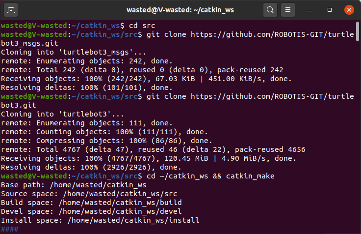
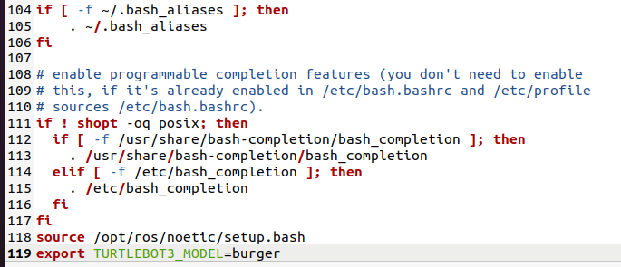
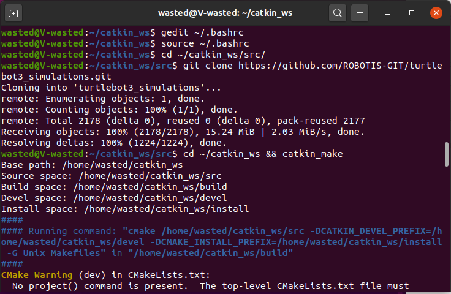
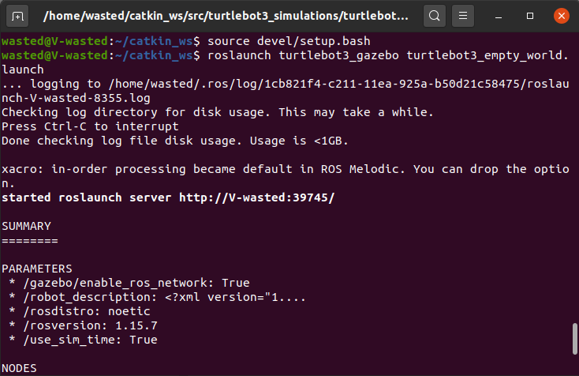
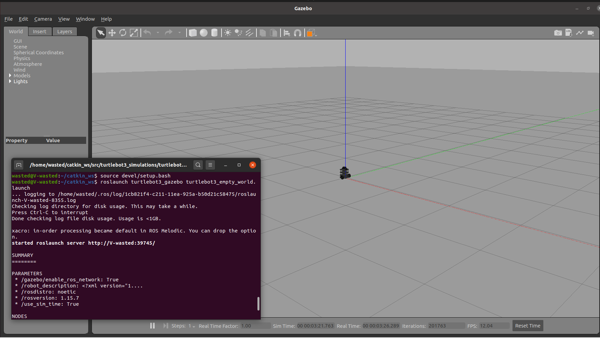
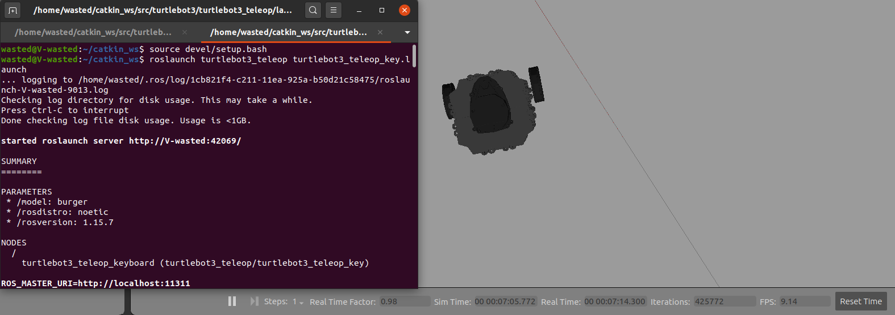

## Installing and running a TurtleBot3 simulator

### 1. Install the dependent packages, starting from your catkin_ws/src folder:
``` cd ~/catkin_ws/src/ ``` 

 ``` git clone https://github.com/ROBOTIS-GIT/turtlebot3_msgs.git ``` 
 
``` git clone https://github.com/ROBOTIS-GIT/turtlebot3.git ```

``` cd ~/catkin_ws && catkin_make ```



#### TurtleBot3 has three models, add this line ` export TURTLEBOT3_MODEL=burger ` at the bottom of the file to go with "burger model" after you enter the command:
``` gedit ~/.bashrc ```



Save and quit the file.

#### reload .bashrc so that you do not have to log out and log back in.
``` source ~/.bashrc ```

### 2. Download the TurtleBot3 simulation files.
``` cd ~/catkin_ws/src/ ```

``` git clone https://github.com/ROBOTIS-GIT/turtlebot3_simulations.git ```

``` cd ~/catkin_ws && catkin_make ```



### 3. Launch the virtual robot using Gazebo

#### First,launch TurtleBot3 in an empty environment by : 
` source devel/setup.bash `

``` roslaunch turtlebot3_gazebo turtlebot3_empty_world.launch ```



#### Your screen should look like this:



 ### 4. To control the movement of your TurtleBot:
 In a new terminal tap: 
 
` source devel/setup.bash `
 
 ` roslaunch turtlebot3_teleop turtlebot3_teleop_key.launch `



#### Use the buttons displayed in the terminal to control the movement.


